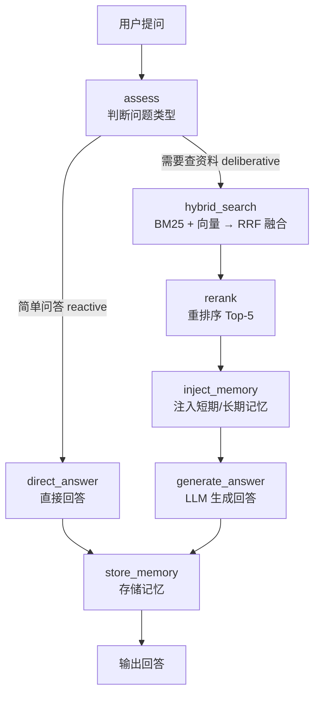

# 混合检索 RAG 知识库系统

一个基于 **LangGraph + 通义千问 + 混合检索** 的 RAG（检索增强生成）知识库问答系统。

核心思路：用户提问后，系统先从你自己的文档库里检索出最相关的段落，再把段落喂给大模型生成回答，让 AI 只依据你的资料回答、不凭空编造。

本系统面向"投资理财"这一垂直场景，内置 **20 份**投资理财知识文档（覆盖基金、债券、黄金、REITs、养老、打新、资产配置等主题，txt / md / docx / pdf 四种格式），但整体架构与具体业务解耦，可替换成任意领域的文档。

---

## 一、核心特性

| 特性 | 说明 |
| --- | --- |
| 混合检索 | BM25 关键词检索 + 向量语义检索，通过 RRF 融合，兼顾专有名词与语义理解 |
| 重排序 | 对候选段落精细重排，默认 SimpleReranker（无需模型），可选 BGE-Reranker |
| 智能路由 | LLM 先判断问题类型，简单问答直接回答，专业问题才走检索 |
| 分级记忆 | 短期记忆（会话内 5 轮）+ 长期记忆（Elasticsearch 跨会话） |
| 效果评估 | LangSmith 追踪 + OpenEvals 的 LLM-as-Judge 自动打分 |
| 多入口 | 命令行、Web 网页、评估脚本三种使用方式 |
| 多种文档格式 | 支持 txt / md / pdf / docx 四种文档 |

---

## 二、系统架构



**数据流转**：文档 → 分块（512 字 / 64 字重叠）→ 建索引（BM25 + 向量）→ 检索 → RRF 融合 → 重排 → 拼进 Prompt → LLM 生成。

**关键组件**：

| 组件 | 技术选型 | 作用 |
| --- | --- | --- |
| 流程编排 | LangGraph | 把 7 个节点串成流水线，支持条件路由 |
| 大模型 | 通义千问 qwen3.7-max（DashScope） | 判断问题类型 + 生成回答 |
| 关键词检索 | rank-bm25 + jieba | 专有名词精确匹配 |
| 向量检索 | FAISS + BGE-large-zh-v1.5 | 语义相似度检索 |
| 混合融合 | RRF（倒数排名融合） | 合并两种检索结果 |
| 重排序 | SimpleReranker / BGE-Reranker | 对候选精排 |
| 短期记忆 | 进程内内存 | 记住当前会话最近 5 轮 |
| 长期记忆 | Elasticsearch | 跨会话的历史问题与偏好 |
| 效果评估 | LangSmith + OpenEvals | 追踪 + LLM 自动打分 |

---

## 三、目录结构

```
hybrid-retrieval-knowledge-base-system/
├── app.py                     # Web 聊天界面入口（Flask）
├── main.py                    # 命令行交互入口
├── run_rag_evaluation.py      # 效果评估入口（LangSmith + OpenEvals）
├── requirements.txt           # 依赖清单
├── set_env.bat / .ps1         # 设置 HuggingFace 缓存到 D 盘 + 国内镜像
├── setup_es.bat / .ps1        # 一键下载并启动本地 Elasticsearch
├── scripts/
│   ├── build_knowledge_docs.py   # 一键生成 20 份知识文档（txt/md/docx/pdf）
│   └── verify_golden_dataset.py  # 校验测试集 doc_id / 关键词与真实 chunk 一致性
├── config/
│   └── settings.py            # 所有配置项（模型、检索参数、路径）
├── core/
│   ├── state.py               # 状态数据结构定义
│   └── workflow.py            # LangGraph 工作流（7 个节点）
├── retrieval/
│   ├── doc_parser.py          # 文档解析 + 分块
│   ├── bm25_retriever.py      # BM25 关键词检索
│   ├── vector_retriever.py    # 向量语义检索（FAISS）
│   ├── hybrid_retriever.py    # RRF 混合融合
│   └── reranker.py            # 重排序器（Simple / BGE）
├── memory/
│   ├── short_term.py          # 短期记忆（内存）
│   └── long_term.py           # 长期记忆（Elasticsearch）
├── evaluation/
│   ├── evaluator.py           # 评估器（Hit Rate / MRR / OpenEvals 裁判）
│   ├── metrics.py             # 确定性指标计算
│   ├── golden_dataset.json    # 标准测试题（60 道）
│   └── reports/               # 本地评估报告输出
├── data/
│   ├── knowledge_base/        # 原始知识文档（.txt/.md/.docx/.pdf）
│   ├── chunks/                # 分块缓存
│   ├── vector_store/          # 向量索引存储
│   └── elasticsearch-8.15.0/  # 本地 ES（由 setup_es 生成）
├── test/                      # 单元测试（unittest）
└── 知识库系统初学者指南.html    # 面向新手的通俗图解
```

---

## 四、快速开始

### 1. 环境要求

- **操作系统**：Windows（脚本均为 `.bat` / `.ps1`）
- **Python**：3.9 及以上（建议 3.10+）
- **网络**：需能访问阿里云 DashScope API；BGE 向量模型通过国内镜像 `hf-mirror.com` 下载，可选访问 LangSmith 上报评估

### 2. 安装依赖

```bash
# 在项目根目录执行
pip install -r requirements.txt
```

> 首次运行需加载 BGE 向量模型 `BAAI/bge-large-zh-v1.5`（约 1.3GB）。建议先双击 `set_env.bat`（或运行 `.\set_env.ps1`）完成两件事：
> 1. 把 HuggingFace 缓存目录指到 D 盘，节省 C 盘空间；
> 2. 配置国内镜像 `HF_ENDPOINT=https://hf-mirror.com`，让模型通过国内镜像下载（已缓存的模型直接本地加载，不会因连不上 `huggingface.co` 而超时）。

### 3. 配置 API Key

系统通过**环境变量**读取密钥（未使用 `.env` 文件）。运行前先设置 `DASHSCOPE_API_KEY`：

**PowerShell：**
```powershell
$env:DASHSCOPE_API_KEY = "sk-你的通义千问密钥"
```

**CMD：**
```bat
set DASHSCOPE_API_KEY=sk-你的通义千问密钥
```

> 也可以把该变量配置到"系统环境变量"里，一劳永逸。

### 4. 准备知识库文档

把你要让 AI 学习的文档放进 `data/knowledge_base/` 目录即可。系统支持 `.txt`、`.md`、`.pdf`、`.docx`。首次运行会自动解析文档、分块并建立索引。

项目已内置 **20 份**投资理财知识文档，覆盖基金进阶、债券、货币基金、指数基金、复利、资产配置、黄金、REITs、养老、止盈止损、打新等主题，格式分布为 txt × 8、md × 4、docx × 4、pdf × 4。完整清单见 `data/knowledge_base/` 目录；如需重新生成这些文档，运行 `python scripts/build_knowledge_docs.py`。

### 5. 运行

三种方式，任选其一：

#### 方式一：命令行交互

```bash
python main.py
```

输入问题回车即可，输入 `q` / `exit` 退出。

#### 方式二：Web 网页界面

```bash
python app.py
```

浏览器打开 `http://localhost:8080`（端口可用环境变量 `PORT` 修改）。

#### 方式三：效果评估

```bash
# 仅本地检索指标评估（Hit Rate / MRR）
python run_rag_evaluation.py

# 完整 RAG 评估（含 LLM 生成 + OpenEvals 裁判）
python run_rag_evaluation.py --full-rag

# 上报 LangSmith（需先配置 LANGSMITH_API_KEY）
python run_rag_evaluation.py --full-rag --langsmith
```

---

## 五、配置说明

所有配置集中在 `config/settings.py`，其中可通过环境变量覆盖的关键项如下：

| 环境变量 | 默认值 | 说明 |
| --- | --- | --- |
| `DASHSCOPE_API_KEY` | 空 | 通义千问 API 密钥（必填） |
| `LLM_MODEL_NAME` | `qwen3.7-max` | 生成/判断问题所用的模型 |
| `EVAL_LLM_MODEL` | `qwen3.7-max` | 评估裁判（LLM-as-Judge）用的模型 |
| `ES_HOST` | `http://localhost:9200` | Elasticsearch 地址（长期记忆） |
| `ES_USER` / `ES_PASSWORD` | 空 | ES 认证（本地开发通常留空） |
| `LANGSMITH_API_KEY` | 空 | LangSmith 密钥（仅评估上报需要） |
| `LANGCHAIN_TRACING_V2` | 空 | 设为 `true` 开启 LangSmith 追踪 |
| `RAG_EVAL_ENABLED` | 空 | 设为 `true` 启用评估相关配置 |
| `RAG_EVAL_K` | `5` | Hit Rate 评估的 Top-K |
| `PORT` | `8080` | Web 界面端口 |

其余静态配置（如分块大小 `CHUNK_SIZE=512`、重叠 `CHUNK_OVERLAP=64`、BM25/向量 Top-K=20、RRF 平滑因子 `RRF_K=60`、重排 Top-K=5、短期记忆轮数=5 等）可直接在 `config/settings.py` 中修改。

---

## 六、工作流程详解

系统用 LangGraph 定义了一条 7 节点的流水线（见 `core/workflow.py`）：

1. **assess_query**：调用 LLM 判断问题类型（`simple_qa` / `knowledge_retrieval` / `comparative_analysis` / `procedural_guide`）与处理模式（`reactive` / `deliberative`），输出 JSON。
2. **路由**：`reactive` 简单问答直接走 `direct_answer`；`deliberative` 需要查资料走检索链。
3. **hybrid_search**：BM25 与向量两路分别检索 Top-20，用 RRF 融合成候选集。
4. **rerank**：对候选集精细重排，只保留最相关的 Top-5。
5. **inject_memory**：注入短期记忆（最近几轮对话）+ 长期记忆（ES 里相似历史问题），并判断是否为追问。
6. **generate_answer / direct_answer**：把检索段落 + 记忆上下文拼进 Prompt，交给 LLM 生成回答。
7. **store_memory**：把本轮问答写入短期记忆，若 ES 可用再写入长期记忆。

---

## 七、效果评估

评估体系分两层（见 `evaluation/`）：

**确定性指标**（`evaluation/metrics.py`，无需调用 LLM）：
- **Hit Rate@K**：正确答案是否出现在检索结果 Top-K 中
- **MRR**：正确答案排名的倒数均值
- **Keyword Coverage**：回答对期望关键词的覆盖率

**LLM-as-Judge 指标**（`evaluation/evaluator.py`，基于 OpenEvals）：
- **Answer Relevance**：回答是否切题
- **RAG Helpfulness**：回答是否有帮助
- **RAG Groundedness**：回答是否忠于检索到的文档（不编造）
- **Retrieval Relevance**：检索到的文档是否与问题相关

标准测试题位于 `evaluation/golden_dataset.json`，共 **60 道**典型问题，覆盖 20 份知识文档、20 个投资理财子领域；题型分布为 `knowledge_retrieval`（38 道）/ `comparative_analysis`（13 道）/ `procedural_guide`（9 道）。每道题的 `relevant_doc_ids` 指向真实 chunk（格式 `{内容MD5}_{chunk序号}`）、`expected_keywords` 取自对应 chunk 原文。可用 `python scripts/verify_golden_dataset.py` 校验测试集与知识库的一致性。评估结果可在本地报告（`evaluation/reports/`）或 LangSmith 实验页查看。

---

## 八、参与开发

### 代码约定

- 注释使用中文，UTF-8 编码。
- 不引入多余依赖，优先复用已有模块。
- 模块职责单一：`retrieval/` 只做检索、`memory/` 只做记忆、`core/workflow.py` 负责编排。

### 常见扩展点

| 想做什么 | 改哪里 |
| --- | --- |
| 更换向量模型 | `core/workflow.py` 的 `_get_or_init_retriever()` 中 `SentenceTransformer(EMBEDDING_MODEL_NAME)` 换成其他模型 |
| 切换到 BGE 重排模型 | 把 `create_reranker(use_bge=False)` 改为 `use_bge=True` |
| 增加新知识文档 | 直接往 `data/knowledge_base/` 放文件 |
| 增加新的评估指标 | 在 `evaluation/metrics.py` 加函数，再在 `evaluation/evaluator.py` 注册 |
| 调整分块 / 检索参数 | 修改 `config/settings.py` |

### 运行测试

项目使用标准库 `unittest`：

```bash
python -m unittest discover -s test
```

---

## 九、注意事项

- **向量检索已接入 BGE 向量模型**：`core/workflow.py` 中 `VectorRetriever` 已传入 `SentenceTransformer(EMBEDDING_MODEL_NAME)` 编码器，BM25 与向量检索会经 RRF 真正融合。首次运行会下载 `BAAI/bge-large-zh-v1.5`（约 1.3GB）到 D 盘，需先运行 `set_env.bat` 设置缓存目录并配置国内镜像。
- **模型下载走国内镜像**：`set_env.bat` / `set_env.ps1` 会把 `HF_ENDPOINT` 设为 `https://hf-mirror.com`，从而（1）已缓存模型时本地加载，不会因连不上 `huggingface.co` 而在探测 `adapter_config.json` 等文件时卡死超时；（2）新环境在线下载也能跑通（走镜像）。
- **默认重排器是 SimpleReranker**：无需下载模型即可跑通；如需更高精度再切 BGE-Reranker（约 1.3GB）。
- **长期记忆是可选的**：不启动 Elasticsearch 也能正常问答，只是没有跨会话记忆。需要时双击 `setup_es.bat` 一键下载并启动本地 ES。
- **评估依赖 LLM 额度**：OpenEvals 裁判会用 `EVAL_LLM_MODEL` 逐条打分，需保证 DashScope 账号有可用额度，否则评估器会因限流而拿不到反馈分。

---

## 十、常见问题

**Q：为什么不用 ChatGPT 直接回答？**
A：通用大模型不知道你公司/个人的内部资料。RAG 的价值是让 AI 只依据你提供的文档回答，并标注来源，不瞎编。

**Q：BM25 和向量检索有什么区别？**
A：BM25 是"关键词精确匹配"，搜"ETF"很准但不懂同义词；向量检索是"语义理解"，能理解"养老储蓄≈退休规划"，但专有名词可能不准。两者混合互补。

**Q：必须启动 Elasticsearch 吗？**
A：不必须。ES 只负责长期记忆，不启动时系统自动跳过，其余功能正常。

**Q：评估时为什么有的题显示 no feedback？**
A：多为裁判 LLM 免费额度耗尽（403 FreeTierOnly）导致。可将 `EVAL_LLM_MODEL` 换成有额度的模型（如 `qwen3.7-max`）后重跑。

**Q：运行时报 `[WinError 10060]` 连接超时（卡在加载模型）怎么办？**
A：这是 HuggingFace 库在加载模型时向 `huggingface.co` 发在线探测请求（如 `adapter_config.json`），而该域名不可达导致的。运行一次 `set_env.bat`（或 `.\set_env.ps1`）把 `HF_ENDPOINT` 配成 `https://hf-mirror.com` 即可：已缓存的模型会直接本地加载，探测请求也改走可达的国内镜像。
